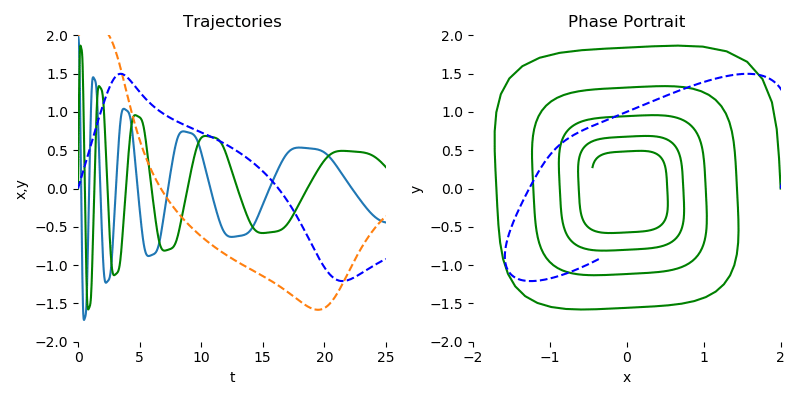

# final project of Neural Differential Equations

This repository contains code for reproducing the experiments from the paper:

Jia, J., & Benson, A. R. (2019). Neural jump stochastic differential equations. Advances in Neural Information Processing Systems, 32.

# PyTorch Implementation of Differentiable ODE Solvers

This library provides ordinary differential equation (ODE) solvers implemented in PyTorch. Backpropagation through all solvers is supported using the adjoint method. For usage of ODE solvers in deep learning applications, see [1].

As the solvers are implemented in PyTorch, algorithms in this repository are fully supported to run on the GPU.


## Installation
```
git clone https://github.com/rtqichen/torchdiffeq.git
cd torchdiffeq
pip install -e .
```

## Examples
Examples are placed in the [`examples`](./examples) directory.

We encourage those who are interested in using this library to take a look at [`examples/ode_demo.py`](./examples/ode_demo.py) for understanding how to use `torchdiffeq` to fit a simple spiral ODE.

<p align="center">

</p>

## Basic usage
This library provides one main interface `odeint` which contains general-purpose algorithms for solving initial value problems (IVP), with gradients implemented for all main arguments. An initial value problem consists of an ODE and an initial value,
```
dy/dt = f(t, y)    y(t_0) = y_0.
```
The goal of an ODE solver is to find a continuous trajectory satisfying the ODE that passes through the initial condition.

To solve an IVP using the default solver:
```
from torchdiffeq import odeint

odeint(func, y0, t)
```
where `func` is any callable implementing the ordinary differential equation `f(t, x)`, `y0` is an _any_-D Tensor or a tuple of _any_-D Tensors representing the initial values, and `t` is a 1-D Tensor containing the evaluation points. The initial time is taken to be `t[0]`.

Backpropagation through `odeint` goes through the internals of the solver, but this is not supported for all solvers. Instead, we encourage the use of the adjoint method explained in [1], which will allow solving with as many steps as necessary due to O(1) memory usage.

To use the adjoint method:
```
from torchdiffeq import odeint_adjoint as odeint

odeint(func, y0, t)
```
`odeint_adjoint` simply wraps around `odeint`, but will use only O(1) memory in exchange for solving an adjoint ODE in the backward call.

The biggest **gotcha** is that `func` must be a `nn.Module` when using the adjoint method. This is used to collect parameters of the differential equation.

### Keyword Arguments
 - `rtol` Relative tolerance.
 - `atol` Absolute tolerance.
 - `method` One of the solvers listed below.

#### List of ODE Solvers:

Adaptive-step:
 - `dopri5` Runge-Kutta 4(5) [default].
 - `adams` Adaptive-order implicit Adams.

Fixed-step:
 - `euler` Euler method.
 - `midpoint` Midpoint method.
 - `rk4` Fourth-order Runge-Kutta with 3/8 rule.
 - `explicit_adams` Explicit Adams.
 - `fixed_adams` Implicit Adams.


## My Experiment
This file can find at 'final_20245494.py', 'final_20245492_result.ipynb', and 'fashion_mnist_model.pth'.
With the incorporation of checkpointing into the adjoint method, I've managed to enhance both the memory efficiency and solver flexibility of the existing ODE solver implementation. These advancements provide a scalable solution for handling large and complex systems, making Neural ODEs and similar models more accessible for practical applications in areas such as healthcare, finance, and real-time monitoring.
> Result
> 
> 
> 
> 


### How to run the code

1. Install required dependencies:
```
pip install torch torchvision
```

2. Run the script:
```
python final_20245494
```

3. Check the new model file, 'fashion_mnist_model.pth'
4. Go to file 'final_20245494_result.ipynb' and run the code. You can check the plot results
   


### References
[1] Ricky T. Q. Chen, Yulia Rubanova, Jesse Bettencourt, David Duvenaud. "Neural Ordinary Differential Equations." *Advances in Neural Processing Information Systems.* 2018. [[arxiv]](https://arxiv.org/abs/1806.07366)

---

If you found this library useful in your research, please consider citing
```
@article{chen2018neural,
  title={Neural Ordinary Differential Equations},
  author={Chen, Ricky T. Q. and Rubanova, Yulia and Bettencourt, Jesse and Duvenaud, David},
  journal={Advances in Neural Information Processing Systems},
  year={2018}
}
```
